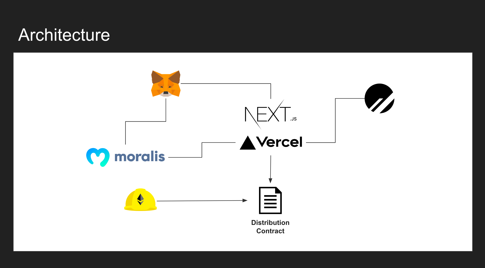

# TOKEN DISTRIBUTOR

This repository contains the smart contract and frontend codes.

It is now live at the following URL.

https://token-distributor.xyz/

## Purpose

This service simplifies and makes transparent the distribution of rewards.

Reward distribution is one of the most important considerations for service operators other than non-profit organizations.

Although there are systems such as NFT that distribute profits from sales on the platform on the platform side, there are sometimes restrictions on this.

In addition, some teams are dealing with the hassle of manually distributing sales after they have been withdrawn.

In such cases, manual distribution may be time-consuming and may result in human error.

TOKEN DISTRIBUTOR allows the definition of the recipient and percentage of distribution on the contract, thereby reducing the time and effort required for remittance to a single step and enabling transparent distribution.

## Capabilities

- Owners can deploy their own contracts from the Web simply by operating the screen.
- The owner can specify the wallet and percentage to be distributed at the time of deployment.
- The owner can distribute the money by sending money to the contract address that is issued after deployment.
- After deployment, the settings and distribution ratio can be visually confirmed on the Web service.
- To prevent human error, the system automatically checks the address and whether the distribution ratio is 100% in total.

## How to use

## Technology Stacks

The following technologies are used.

**Frontend**

- Next.js(React)
- Typescript
- Chakra UI
- ethersjs
- prisma
- Moralis

**Contract**

- Hardhat

**Databaes**

- PlantScale

**Server**

- Vercel
